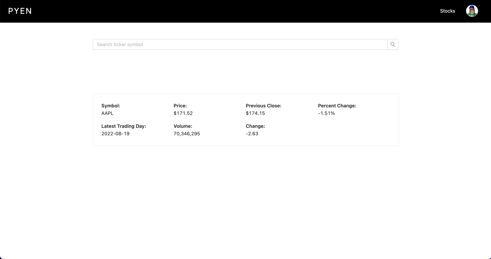

# <h1 align="center"> Pyen</h1>
 #### <h3 align="center">https://github.com/allenaxie/pyen</h3>
 <h5 align="center">Allen Xie</h5>

 

## 📝 Description

Pyen is a personal finance application created to promote awareness and increase organization in personal finance. 

A user can login via a Google account. The user will then be able to create entries for each of their bank/brokerage accounts and track their net worth each month. The user will also be able to see the change of their net worth over time through a responsive, animated line graph.

For users who are interested in stocks, they are also able to view upcoming IPOs in the 'IPO Calendar' page. In the 'Stocks List' page, a user can search for a stock and view related stats such as ticker symbol, latest price, and recent price change.

## 📸 Screenshots 

| | | |
|:-------------------------:|:-------------------------:|:-------------------------:|
| |  |  
| 

## 💻 Technologies Used 

- HTML
- CSS
- JavaScript
- TypeScript
- MongoDB
- Next.js
- NextAuth
- Ant Design
- Chart.js
- Sass

Link to Deployed App -- <https://pyen.vercel.app/>

## ⏭️ Next Steps
- Implement another stocks API. Current API limits to 5 requests/min.
